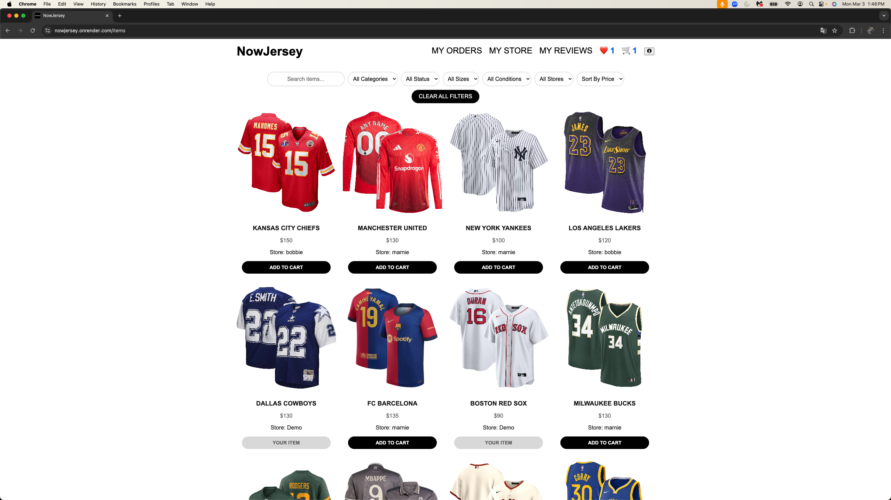

# NowJersey

NowJersey is a platform that connects sports enthusiasts with buyers and sellers, offering a wide range of jerseys across multiple sport categories. Whether you're looking to buy, sell, or maybe trade, NowJersey makes it easy to find the perfect jersey while fostering a community of sports fans.

# Live Link

[NowJersey](https://nowjersey.onrender.com/)

## Tech Stack
### Frameworks and Libraries
      

 ### Database:
 
  
 ### Hosting:
 

# Index
- [Database Schema][database-schema]
- [Future List][future-list]
- [User Stories][user-stories]
- [Wireframes][wireframes]

<!-- Reference-style link definitions -->
[database-schema]: https://github.com/burakoncuy/NowJersey/wiki/DATABASE-SCHEMA
[future-list]: https://github.com/burakoncuy/NowJersey/wiki/MVP's-FEATURE-LIST
[user-stories]: https://github.com/burakoncuy/NowJersey/wiki/USER-STORIES
[wireframes]: https://github.com/burakoncuy/NowJersey/wiki/WIREFRAMES

# Endpoints

## User Auth Sign in and Sign Up

Users can log into an existing account or sign up and create a new account. Users can also test the site with the Demo Login feature.

## Users can view all listing items and make search or filtering based on categories, price, size, status,condition, store and add to Cart.

## Users can create , update and delete their own items.

## Users can view item's details can add to cart or add to favorite and add a review.

## Users can view their favorites and remove them from favorites

## Users can list their reviews and update or delete them .

## Cart

Users can add items by clicking on add to cart and view, remove items and check out in the shopping cart.

## Order

Users can view their orders , cancel them before shipped or change the status of the item that they sold .

### Auth Endpoints

Method | Endpoint | Description | Request Body (JSON) | Response
--------|---------|-------------|--------------------- |---------
**GET** | `/auth/` | Authenticates a user. | None | **If authenticated:** `{ "id": 1, "username": "user1", "email": "user1@example.com" }` **If not authenticated:** `{ "errors": { "message": "Unauthorized" } }` (401)
**POST** | `/auth/login` | Logs a user in. | `{ "email": "user1@example.com", "password": "password123" }` | **If successful:** `{ "id": 1, "username": "user1", "email": "user1@example.com" }` **If failed:** Form errors (401)
**GET** | `/auth/logout` | Logs a user out. | None | `{ "message": "User logged out" }`
**POST** | `/auth/signup` | Creates a new user and logs them in. | `{ "username": "user1", "email": "user1@example.com", "password": "password123" }` | **If successful:** `{ "id": 1, "username": "user1", "email": "user1@example.com" }` **If failed:** Form errors (401)
**GET** | `/auth/unauthorized` | Returns unauthorized JSON. | None | `{ "errors": { "message": "Unauthorized" } }` (401)

---

### Item Endpoints

Method | Endpoint | Description | Request Body (JSON) | Response
--------|---------|-------------|---------------------|----------
**GET** | `/api/items/` | Get all items. | None | `[ { "id": 1, "name": "Jersey", "price": 50.99, ... }, ...]`
**GET** | `/api/items/<int:id>` | Get a specific item by ID. | None | `{ "id": 1, "name": "Jersey", "price": 50.99, ... }` or `{ "message": "Item not found" }` (404)
**GET** | `/api/items/current` | Get items owned by the current user. | None | `{ "items": [ { "id": 1, "name": "Jersey", ... }, ...] }` or `{ "message": "No items found" }`
**POST** | `/api/items/new` | Create a new item. | `{ "name": "Jersey", "description": "A cool jersey", "price": 50.99, "category": "Sports", "condition": "NEW", "size": "M", "item_status": "available", "image": file }` | `{ "id": 1, "name": "Jersey", ... }` (201) or `{ "errors": { "name": "This field is required" } }` (400)
**PUT** | `/api/items/<int:id>/update` | Update an item. | `{ "name": "Updated Jersey", "description": "Updated description", "price": 55.99, "category": "Sports", "condition": "NEW", "size": "M", "item_status": "available", "image": file }` | `{ "id": 1, "name": "Updated Jersey", ... }` (200) or `{ "error": "Item not found" }` (404) or `{ "error": "Unauthorized to update this item" }` (403)
**DELETE** | `/api/items/<int:id>/delete` | Delete an item. | None | `{ "message": "Item successfully deleted" }` (200) or `{ "errors": ["Item not found"] }` (404) or `{ "error": "Unauthorized to delete this item" }` (403)

---

### Review Endpoints

Method | Endpoint | Description | Request Body (JSON) | Response
--------|---------|-------------|---------------------|----------
**GET** | `/api/items/<int:id>/reviews` | Get reviews for a specific item. | None | `[ { "id": 1, "rating": 5, "comment": "Great product!", "user_name": "JohnDoe" }, ...]` (200) or `{ "message": "No reviews yet" }` (404)
**POST** | `/api/items/<int:id>/reviews` | Add a review to an item. | `{ "rating": 5, "comment": "Great product!" }` | `{ "id": 1, "rating": 5, "comment": "Great product!", "user_id": 2, ... }` (201) or `{ "message": "Item not found" }` (404) or `{ "errors": { "rating": "This field is required" } }` (400)
**PUT** | `/reviews/<int:id>` | Update a review (only by the user who created it). | `{ "comment": "Updated comment", "rating": 5 }` | `{ "id": 1, "comment": "Updated comment", "rating": 5, ... }` (200) or `{ "message": "Review not found" }` (404) or `{ "message": "You can only update your own reviews" }` (403)
**DELETE** | `/reviews/<int:id>` | Delete a review (only by the user who created it). | None | `{ "message": "Review deleted successfully" }` (200) or `{ "message": "Review not found" }` (404) or `{ "message": "Unauthorized" }` (403)

---

### Cart Endpoints

Method | Endpoint | Description | Request Body (JSON) | Response
--------|---------|-------------|---------------------|----------
**GET** | `/cart/` | View current user's cart. | None | `{ "message": "Your cart is empty." }` (200) or `[ { "id": 1, "user_id": 1, "item_id": 1, "quantity": 2, "item": { "id": 1, "name": "Item 1", ... } }, ...]` (200)
**POST** | `/cart/` | Add item to the cart. | `{ "item_id": 1, "quantity": 2 }` | `{ "id": 1, "user_id": 1, "item_id": 1, "quantity": 2, ... }` (201) or `{ "message": "Item not found." }` (404)

---

### Order Endpoints

Method | Endpoint | Description | Request Body (JSON) | Response
--------|---------|-------------|---------------------|----------
**GET** | `/orders/` | List orders (buyer or seller). | None | `[ { "id": 1, "user_id": 1, "total": 100.0, "order_status": "PENDING", "order_items": [ { "id": 1, "item_id": 1, "quantity": 2, "price": 50.0, "item": { "id": 1, "name": "Item 1", ... } } ] } ]` (200)
**POST** | `/orders/checkout` | Create a new order (checkout). | None | `{ "order": { "id": 1, "user_id": 1, "total": 100.0, "order_status": "PENDING", ... }, "sold_items": [ { "id": 1, "name": "Item 1", ... } ] }` (201) or `{ "message": "Your cart is empty." }` (400)

# Feature List
1. Advanced search options to filter items by category, store , condition , size , availability
2. 

# Feature Implementation Goals
1. ChatHelpBot (websockets)
2. Diverse Payment System Integration
3. Real-time notifications
